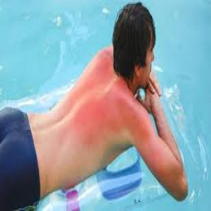
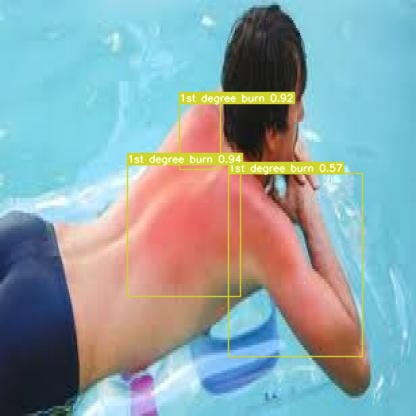

# Skin Burn Detector using Yolov7


### Steps to run Code
- Clone the repository.
```
git clone https://github.com/noorkhokhar99/Burn-Detection-Classification.git
```
- Goto the cloned folder.
```
cd Burn-Detection-Classification

```
- Upgrade pip with mentioned command below.
```
pip install --upgrade pip
```
- Install requirements with mentioned command below.
```
pip install -r requirements.txt
```
- Run the code with mentioned command below.
```

```


#### Begin Inferencing:

Download the pre-trained weights and place them into the same master folder: [Skin_burn_2022_8_21.pt]()

The sample images can be found in the folder inference, the name of each image corresponds to the ground truth value of each image(the model should predict those values after each run).

Below is the file: `1st_degree_2.jpg` (which is sunburn so the model should know that it is first degree)

<div align="center">
    <a href="./">
        
    </a>
</div>


On video:

``` shell
python detect.py --weights Skin_burn_2022_8_21.pt  --source yourvideo.mp4
```

On image:
``` shell
python detect.py --weights Skin_burn_2022_8_21.pt --source inference/images/first_degree_2.jpg
```

<div align="center">
    <a href="./">
        
    </a>
</div>


